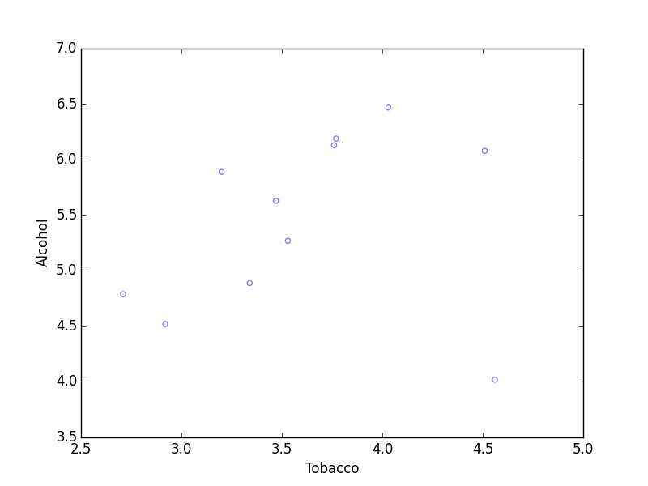

# Linear lest squares regression

The example is taken from Conor Johnson's [blog](http://connor-johnson.com/2014/02/18/linear-regression-with-python/).
We will use the Alcohol vs. Tobacco data from [here](http://lib.stat.cmu.edu/DASL/Stories/AlcoholandTobacco.html). The data is
shown below

Results from regression using [Pandas](http://pandas.pydata.org/) and [Statsmodels](http://statsmodels.sourceforge.net/). The code in python can be
found [here](../code/regression/regression.py) and the corresponding data [here](../data/alcohol_v_tobacco.csv). The summary is shown below.

                                OLS Regression Results
    ==============================================================================
    Dep. Variable:                Alcohol   R-squared:                       0.615
    Model:                            OLS   Adj. R-squared:                  0.567
    Method:                 Least Squares   F-statistic:                     12.78
    Date:                Mon, 03 Aug 2015   Prob (F-statistic):            0.00723
    Time:                        14:33:48   Log-Likelihood:                -4.9998
    No. Observations:                  10   AIC:                             14.00
    Df Residuals:                       8   BIC:                             14.60
    Df Model:                           1
    ==============================================================================
                     coef    std err          t      P>|t|      [95.0% Conf. Int.]
    ------------------------------------------------------------------------------
    Tobacco        1.0059      0.281      3.576      0.007         0.357     1.655
    Eins           2.0412      1.001      2.038      0.076        -0.268     4.350
    ==============================================================================
    Omnibus:                        2.542   Durbin-Watson:                   1.975
    Prob(Omnibus):                  0.281   Jarque-Bera (JB):                0.904
    Skew:                          -0.014   Prob(JB):                        0.636
    Kurtosis:                       1.527   Cond. No.                         27.2
    ==============================================================================
